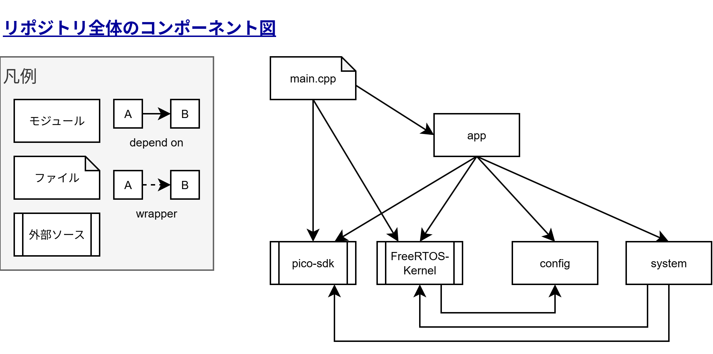

# pico2-thermometer Component図

## コンポーネント図

### 各コンポーネント説明

| コンポーネント  | 内容                                                         |
| --------------- | ------------------------------------------------------------ |
| main.cpp        | 起動ポイントで、タスク生成・スケジューリングの開始を行う。最低限の初期化しか行わない。 |
| app             | 各アプリケーションの実装とアプリケーションタスクの生成を担う。 |
| config          | FreeRTOS config, アプリケーション設定, 本体の設定など。※ 将来的にpico-sdkへの依存関係が追加される可能性もあり |
| system          | assert, hook関数など、システム独自関数                       |
| pico-sdk        | pico2w のdriver ~ HAL関数                                    |
| FreeRTOS-Kernel | FreeRTOSのソース                                             |

